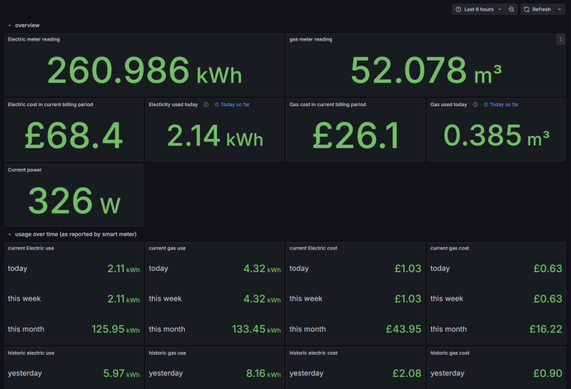
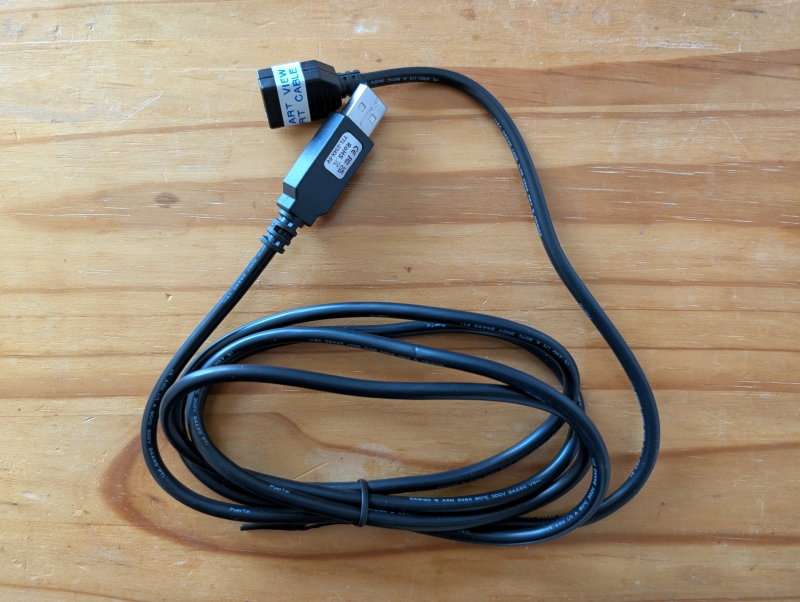

Prometheus exporter for smart meter data
========================================

This software is designed to decode serial data outputed by the smart view 3 IHD supplied with some UK smart meters and make it avalible as metrics that can be read by [prometheus](https://prometheus.io/).
The software can output meter reading data as well as information on current and previous usage and costs
The easiest way to use this is to run it as a docker container, however the software can also be run on a host directly if prefered.



## Usage via docker

If running via docker the following docker compose file can be used as a reference for setting things up. See the inline comments for the parts that need editing

``` yml
services:
  smart_meter_exporter:
    image: ghcr.io/tyler-ward/smart_meter_prometheus_exporter:master
# if connecting to an external network set the network below to the one used by your prometheus instance
    networks:
      - prometheus
    restart: always
# the USB-Serial device needs to be passed through to the container, it is recomended to pass the device through by ID to avoid issues should it get enumerated in a differnt order after a reboot
    devices:
      - "/dev/serial/by-id/usb-FTDI_smart-view-3-uart-adapter_FT8YSM42-if00-port0:/dev/ttyUSB0"
# an alternative to connecting it to an existing promethus container network is to publish the metrics to a port on the host
#    ports:
#      - "8000:8000"

# set to the same network in the network section above, if not using a docker network for prometheus this section can be removed
networks:
  prometheus:
    external: true

```

example prometheus scrape configuration

``` yml
  - job_name: "smart_meter"
    scrape_interval: 10s
    static_configs:
      - targets: ["smart_meter_exporter:8000"]
```

### Additional options

Logging of recieved data from the smart meter display for debugging purposes can be enabled by setting the ```RECORD_DATA=True``` environment variable. If doing this a volume to store the logged data should also be created as shown below

``` yml
# add the following to your docker compose file
    environment:
      - RECORD_DATA=True
    volumes:
      - ./packet_logs:/packet_logs
```

## grafana dashboard

An example grafana dashboard can be found in [the grafana dashboard examples][grafana-dashboard] or via the grafana-dashboard.json file in this repostitory.

## Connection cable

To use this softwre a custom connection cable is required to connect the display to a computer running the software.
To build this cable I used a FTDI USB-Serial cable with A female USB connector attached, then a standard micro USB cable to connect to the display.
I also set the name of the USB-Serial cable using the tool from FTDI to make it clear what it is connected to.
Note the display requres a micro USB cable with a small end so not all cables will fit.



### Parts list used

* FTDI Cable (TTL-234X-5V)
* Adafruit female USB connector (1388) - Note: this requires drilling out the cable entry to fit the FTDI cable.
* generic USB micro cable that fits the unit

### Pinout

| USB Connector | FTDI cable |
| ------------- | ---------- |
| VCC           | 5V         |
| D-            | RX         |
| D+            | NC         |
| GND           | GND        |


[grafana-dashboard]: https://grafana.com/grafana/dashboards/23295